# 🍽️ FoodieHub
## Restaurant Review & Community Platform

**FoodieHub**는 맛집 리뷰, Kakao Maps 기반 위치 검색, 계층형 댓글 시스템, 그리고 역할 기반 접근 제어를 통합한 종합 레스토랑 리뷰 플랫폼입니다.

---

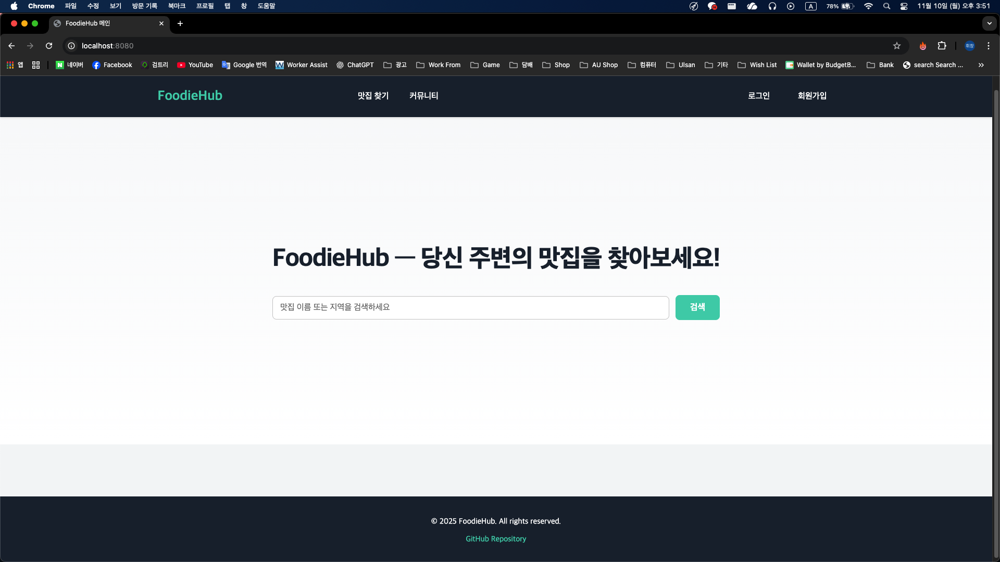 

---

## 🌟 주요 기능 개요

| 기능명 | 설명 | 기술 강점 |
|--------|------|---------|
| **맛집 검색 & 지도 통합** | Kakao Maps API를 활용한 실시간 위치 기반 검색 | 외부 API 연동, 실시간 데이터 처리 |
| **리뷰 시스템** | 이미지 업로드, 평점, 상세 리뷰 작성 | 멀티파트 파일 처리, 데이터 유효성 검증 |
| **계층형 댓글 시스템** | 댓글 및 대댓글의 다단계 구조 구현 | 재귀 데이터 구조, 복잡한 쿼리 최적화 |
| **커뮤니티 게시판** | 카테고리별 게시글 관리, 검색 & 필터링 | 역할 기반 접근 제어 (Role-based Access) |
| **사용자 관리 시스템** | 회원가입, 로그인, 프로필 관리 | Spring Security 기반 인증/인가 |
| **관리자 대시보드** | 사용자 관리, 공지사항, 통계 분석 | 권한 관리, 복합 쿼리 작성 |
| **OAuth 소셜 로그인** | Kakao, Naver 소셜 통합 | 보안 토큰 관리, 외부 API 연동 |

---

## 🛠️ 기술 스택

### 📌 Backend
- **Framework:** Spring Boot 3.5.6
- **Language:** Java 17
- **Security:** Spring Security + BCrypt
- **ORM:** MyBatis 3.0.5
- **API:** RESTful Architecture
- **Libraries:** Lombok, Jackson 2.17.2

<p align="left">
  
  
  
  
</p>

### 📌 Frontend
- **Template Engine:** Thymeleaf
- **Styling:** Custom CSS (반응형 디자인)
- **Scripting:** Vanilla JavaScript
- **Maps Integration:** Kakao Maps API

<p align="left">
  
  
  
  
</p>

### 📌 Database & Infrastructure
- **DBMS:** MySQL 8.0.34
- **Connection Pool:** HikariCP
- **IDE:** Eclipse (macOS)
- **File Upload:** MultipartFile (최대 10MB)

<p align="left">
  
  
</p>

### 📌 External APIs & Tools
- **Maps:** Kakao Maps API
- **OAuth:** Kakao, Naver Social Login
- **Testing:** JUnit, Spring Security Test
- **Development:** Spring DevTools

---

## 📁 프로젝트 구조

<details>
  <summary> 📁 프로젝트 구조 보기 </summary>

```
FoodieHub/
├── src/main/java/org/embed/
│   ├── controller/           # 요청 처리 (30+ 엔드포인트)
│   │   ├── UserController.java
│   │   ├── RestaurantController.java
│   │   ├── ReviewController.java
│   │   ├── BoardController.java
│   │   └── AdminController.java
│   │
│   ├── service/              # 비즈니스 로직
│   │   ├── UserService.java
│   │   ├── RestaurantService.java
│   │   ├── ReviewService.java
│   │   ├── CommentService.java (계층형 댓글)
│   │   └── AdminService.java
│   │
│   ├── mapper/               # MyBatis 매퍼 (DAO)
│   │   ├── UserMapper.java
│   │   ├── RestaurantMapper.java
│   │   ├── ReviewMapper.java
│   │   ├── CommentMapper.java
│   │   └── BoardMapper.java
│   │
│   ├── dto/                  # 데이터 전송 객체
│   │   ├── UserDTO.java
│   │   ├── RestaurantDTO.java
│   │   ├── ReviewDTO.java
│   │   └── CommentDTO.java
│   │
│   ├── configuration/        # 설정
│   │   ├── SecurityConfig.java      # Spring Security 설정
│   │   ├── WebConfig.java           # Web 설정
│   │   └── FileUploadConfig.java    # 파일 업로드 설정
│   │
│   └── util/                 # 유틸리티
│       ├── FileUploadUtil.java
│       └── PasswordUtil.java
│
├── src/main/resources/
│   ├── application.properties         # 설정 파일
│   ├── mappers/                       # MyBatis XML 쿼리
│   │   ├── UserMapper.xml
│   │   ├── RestaurantMapper.xml
│   │   ├── ReviewMapper.xml
│   │   ├── CommentMapper.xml
│   │   └── BoardMapper.xml
│   │
│   └── templates/                     # Thymeleaf 템플릿
│       ├── layout/
│       │   └── layout.html
│       ├── user/
│       │   ├── login.html
│       │   ├── signup.html
│       │   └── mypage.html
│       ├── restaurant/
│       │   ├── list.html
│       │   ├── detail.html
│       │   ├── add.html
│       │   └── edit.html
│       ├── review/
│       │   ├── list.html
│       │   └── create.html
│       ├── board/
│       │   ├── list.html
│       │   ├── detail.html
│       │   └── create.html
│       └── admin/
│           └── dashboard.html
│
├── src/main/webapp/
│   └── resources/
│       ├── css/
│       │   ├── layout.css
│       │   ├── user.css
│       │   ├── restaurant.css
│       │   ├── review.css
│       │   ├── board.css
│       │   └── admin.css
│       │
│       ├── js/
│       │   ├── restaurant-detail.js
│       │   ├── review.js
│       │   ├── board.js
│       │   └── admin.js
│       │
│       └── uploads/                  # 업로드 파일 저장
│           ├── profile/
│           ├── restaurant/
│           └── review/
│
├── pom.xml                           # Maven 의존성
├── README.md                         # 프로젝트 문서
├── COMMENT_STYLE_GUIDE.md           # 코드 주석 규칙
└── DEV_ENVIRONMENT.md               # 개발 환경 설명
```

</details>

---

## 🏗️ 시스템 플로우차트

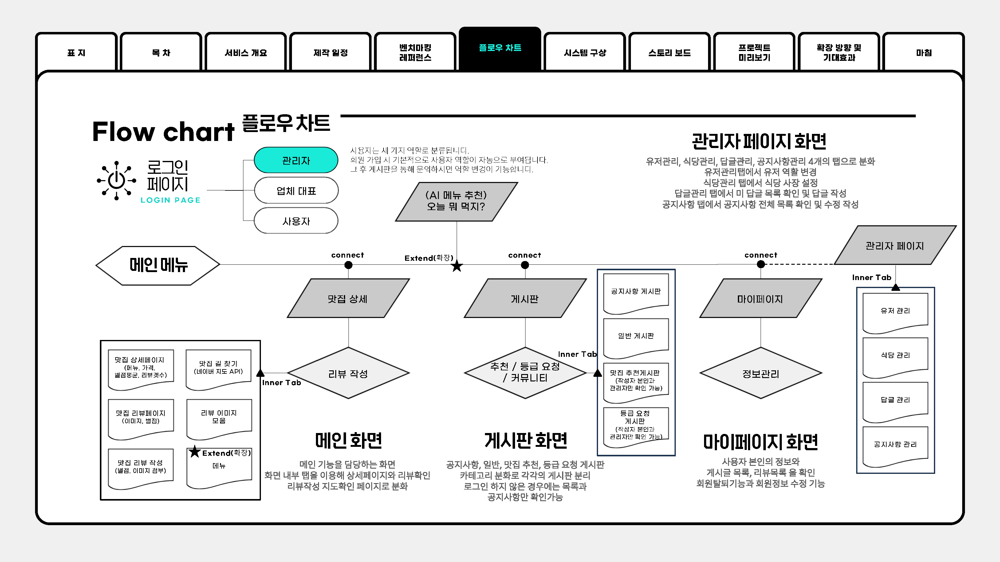

**주요 흐름:**
- **사용자 플로우:** 로그인 → 메인페이지 → 맛집 검색 → 상세보기 → 리뷰 작성 → 마이페이지
- **관리자 플로우:** 관리자 대시보드 → 사용자/식당/콘텐츠 관리
- **외부 연동:** Kakao Maps (위치 검색), OAuth (소셜 로그인)

---

## 📊 Database ERD & 스키마

### Entity-Relationship Diagram

<details>
  <summary><strong>📍 ERD 보기 (클릭하여 확인)</strong></summary>
  
  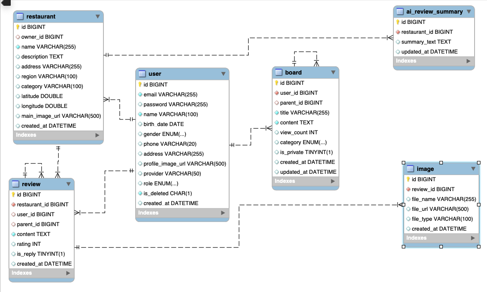
  
  **주요 테이블:**
  - users: 회원정보, 역할(USER/OWNER/ADMIN)
  - restaurants: 식당 정보, 위치, 카테고리
  - reviews: 평점, 리뷰 텍스트, 이미지
  - comments: 계층형 댓글 (parent_comment_id)
  - board_posts: 게시글, 카테고리별 분류
  - board_comments: 게시글 댓글

</details>

---

## 🎬 전체 페이지 & 기능 (자세히 보기)

<details>
  <summary>✨ 사용자 관리 시스템</summary>

  <h3>◈ 로그인 페이지</h3>
  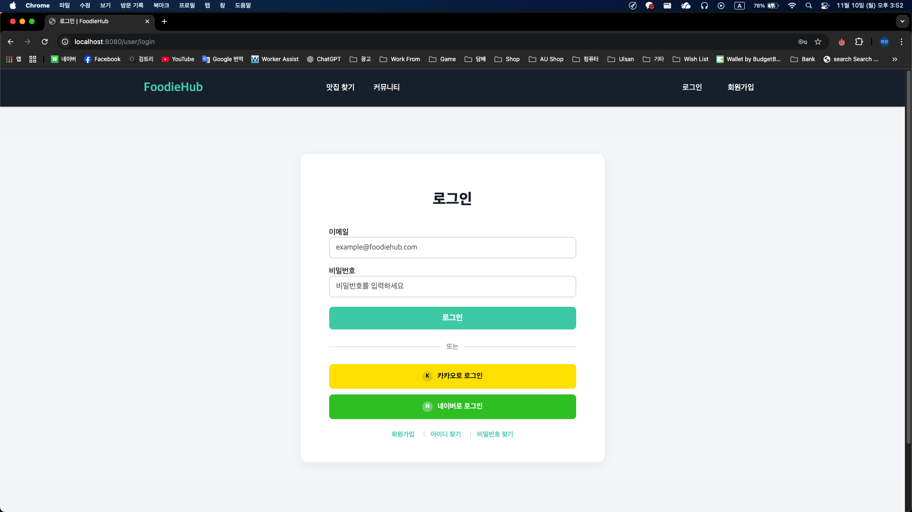
  <p><strong>특징:</strong> Spring Security 기반 인증, Kakao & Naver OAuth 소셜 로그인</p>

  <h3>◈ 회원가입 페이지</h3>
  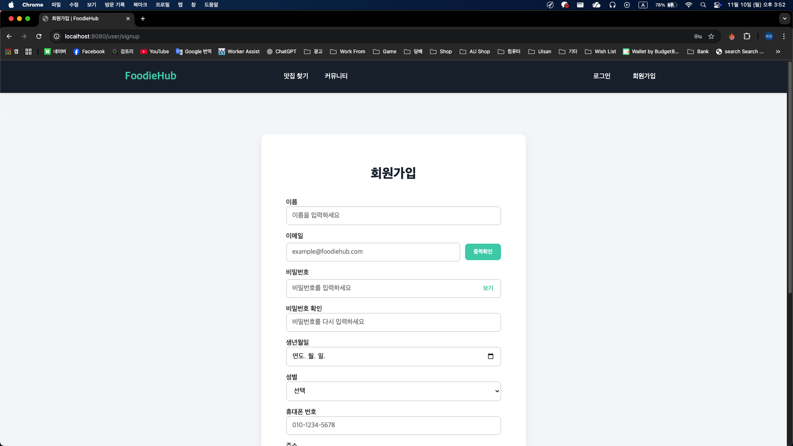
  <p><strong>특징:</strong> 이메일 중복확인 (AJAX), 프로필 이미지 업로드, 유효성 검증</p>

  <h3>◈ 마이페이지</h3>
  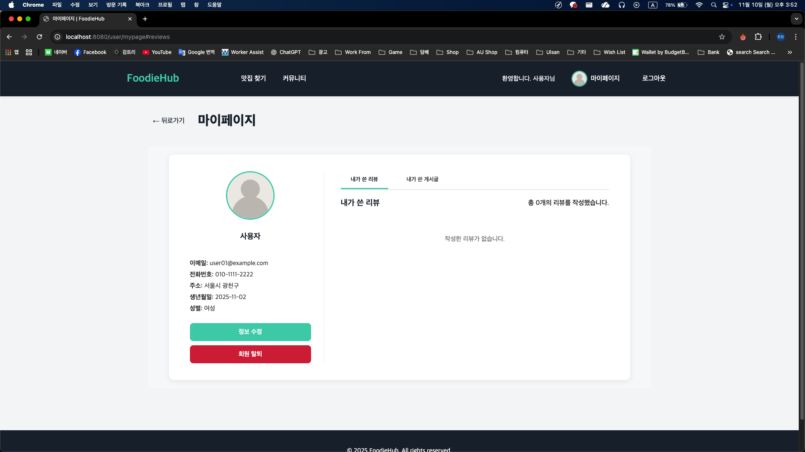
  <p><strong>특징:</strong> 작성한 리뷰/게시글 목록, 프로필 정보 관리, 회원정보 수정</p>

</details>

<details>
  <summary>🍽️ 맛집 검색 & 상세정보</summary>

  <h3>◈ 맛집 검색 (필터 & 지도)</h3>
  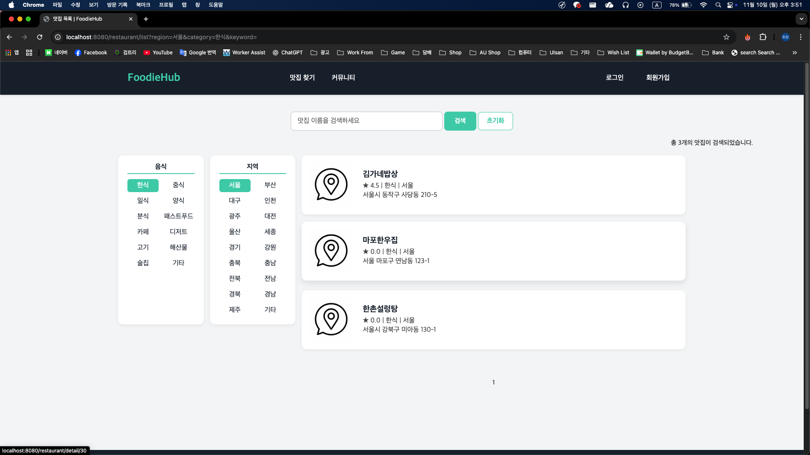
  <p><strong>특징:</strong> 지역/카테고리별 필터링, 카드 형식 UI, Kakao Maps 지도 연동</p>

  <h3>◈ 맛집 상세정보 (지도 탭)</h3>
  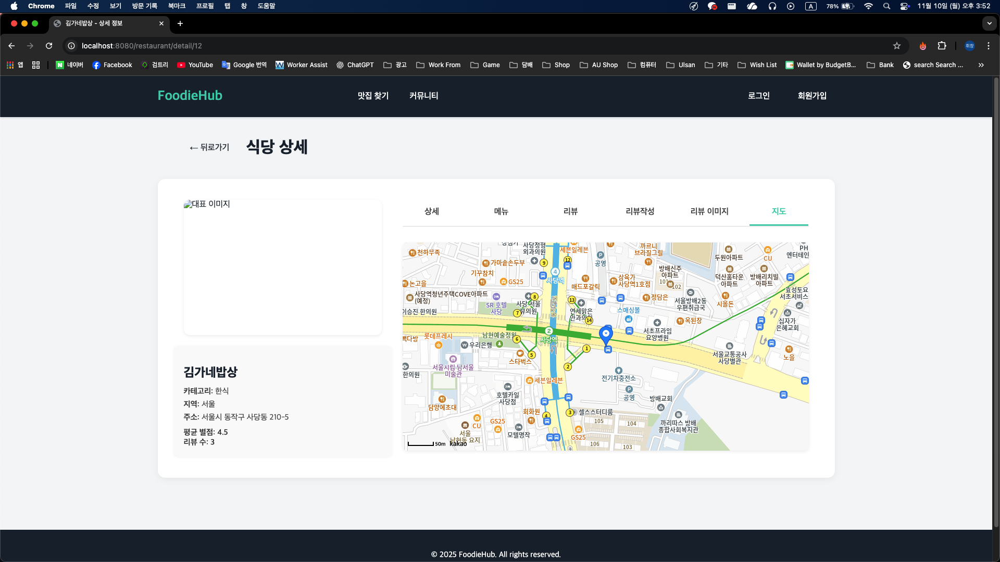
  <p><strong>특징:</strong> Kakao Maps API 위치 표시, 영업시간/주소/연락처, 평점 표시</p>

  <h3>◈ 맛집 추가 (폼)</h3>
  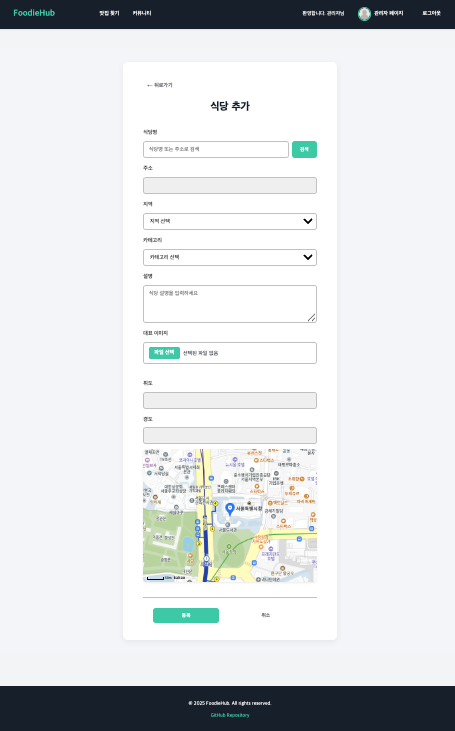
  <p><strong>특징:</strong> 식당명, 주소, 카테고리 입력, Kakao Maps 위치 선택 (마커 드래그), 이미지 업로드</p>

  <h3>◈ 맛집 정보 수정 (폼)</h3>
  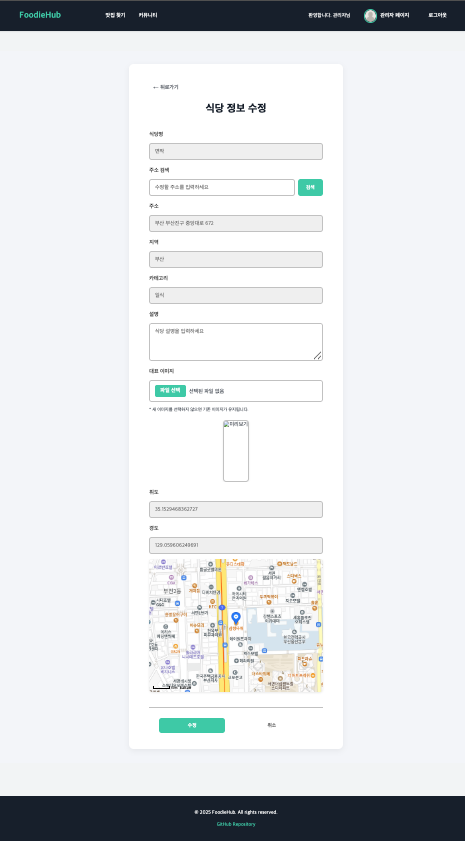
  <p><strong>특징:</strong> 상세한 정보 수정 폼, 위치 재선택, 카테고리/서비스 변경</p>

</details>

<details>
  <summary>⭐ 리뷰 & 평가 시스템</summary>

  <h3>◈ 리뷰 작성 페이지</h3>
  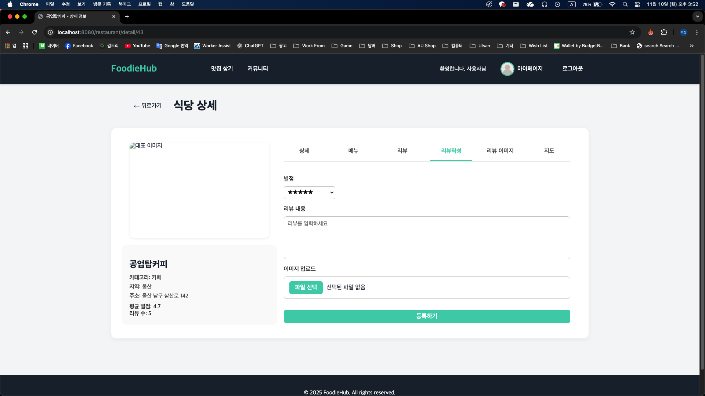
  <p><strong>특징:</strong> 5단계 별점 평가, 이미지 업로드, 상세 의견 작성</p>

  <h3>◈ 리뷰 상세</h3>
  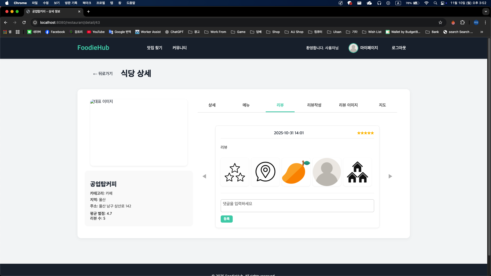
  <p><strong>특징:</strong> 이미지 함께보기, 댓글 기능</p>

</details>

<details>
  <summary>💬 커뮤니티 게시판</summary>

  <h3>◈ 게시판 목록</h3>
  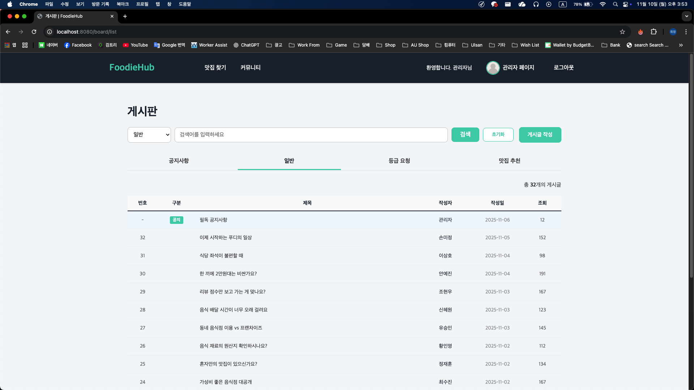
  <p><strong>특징:</strong> 카테고리 탭 (공지/일반), 검색 & 필터, 작성자/작성일 표시, 조회수</p>

  <h3>◈ 게시글 작성</h3>
  
  <p><strong>특징:</strong> 카테고리 선택(권한체크), 제목/내용 입력, 마크다운 지원, 이미지 업로드</p>

  <h3>◈ 게시글 상세</h3>
  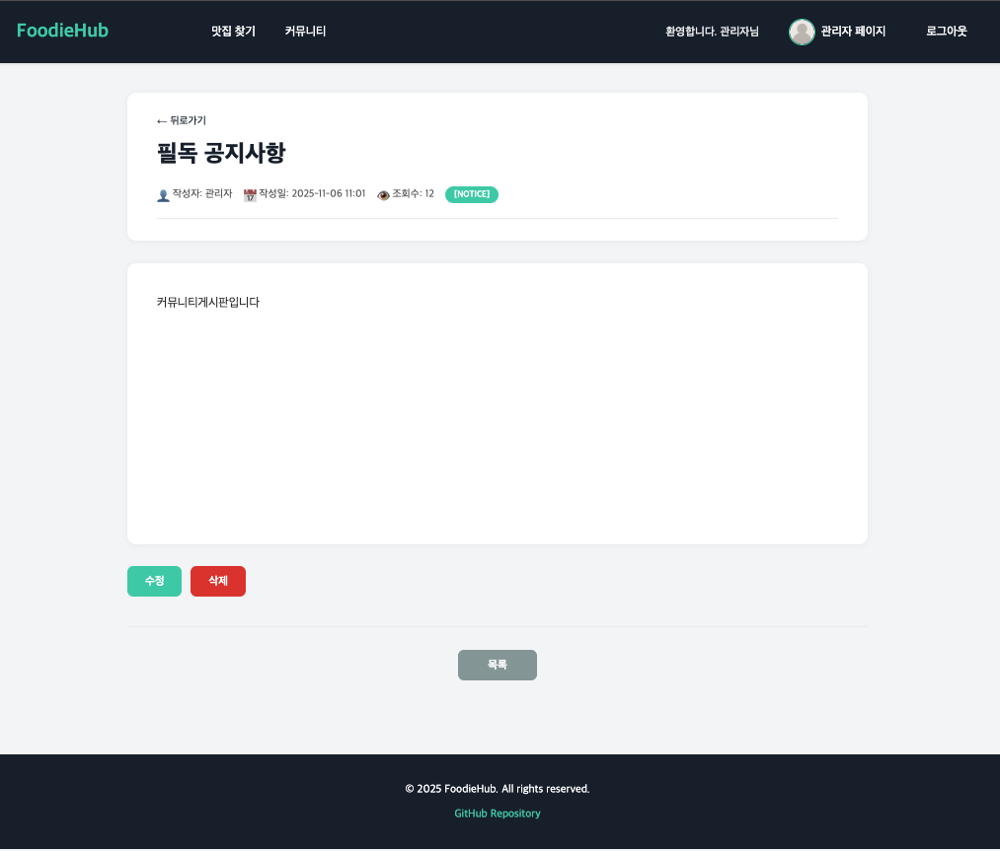
  <p><strong>특징:</strong> 작성자/수정일 정보, 본문 내용, <strong>계층형 댓글 시스템</strong>, 댓글 작성</p>

  <h3>◈ 댓글 계층 구조 & 댓글 작성</h3>
  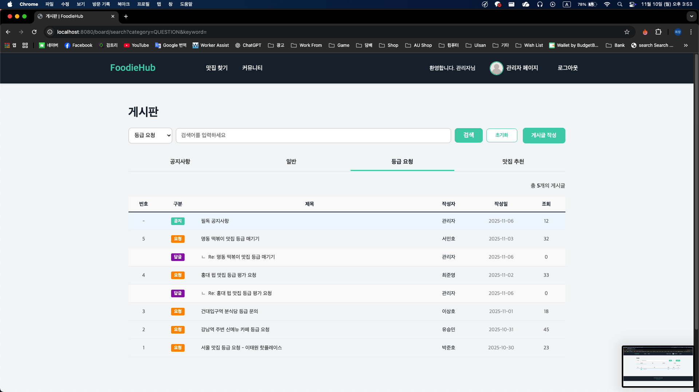
  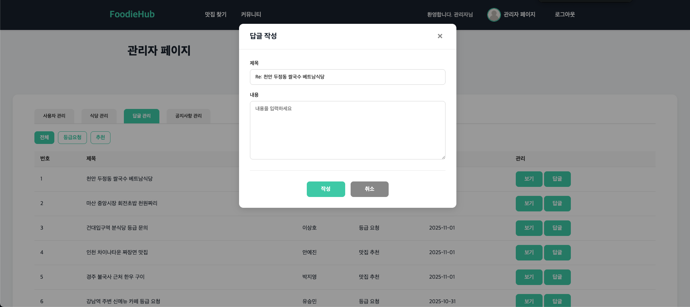
  <p><strong>특징:</strong> 등급 요청 게시판, 작성자/작성일 표시, 모달형 댓글 작성(관리자페이지)</p>

</details>

<details>
  <summary>⚙️ 관리자 기능</summary>

  <h3>◈ 관리자 대시보드</h3>
  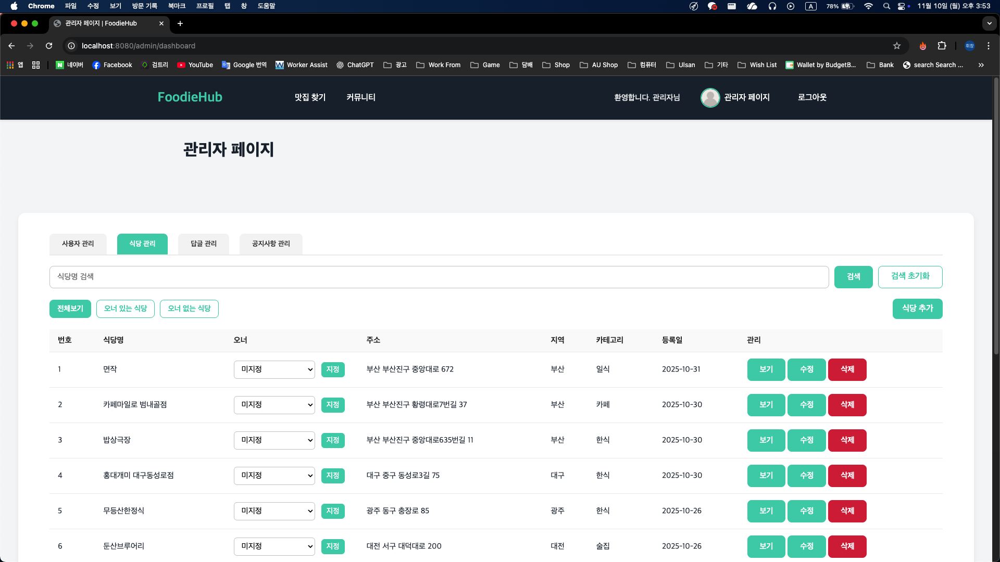
  <p><strong>특징:</strong> 식당 관리 탭, 역할 관리, 등록일 표시, 상태 관리 (검색/수정/삭제)</p>

  <h3>◈ 사용자 관리</h3>
  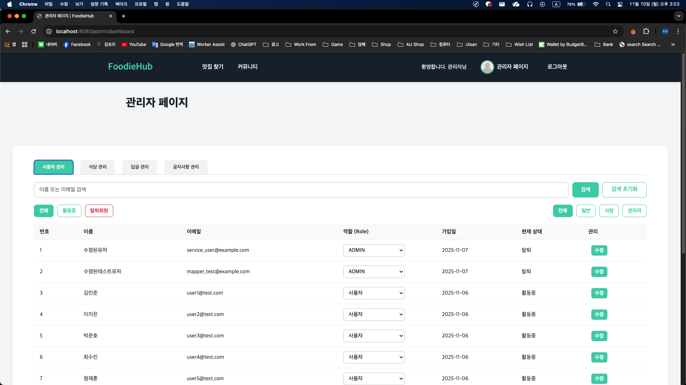
  <p><strong>특징:</strong> 전체 회원 목록, 이메일/역할 확인, 권한 변경 (드롭다운), 상태 관리</p>

</details>

## 🔐 보안 구현

<details>
  <summary><h3>🛡️ 전체 보안 아키텍처</h3></summary>

FoodieHub는 엔터프라이즈급 보안을 구현하여 사용자 정보와 데이터를 철저히 보호합니다.

**보안 계층:**
```
보안 계층 (위→아래):
  [CSRF 토큰 + XSS 방지]
         ↓
  [Spring Security 필터 체인]
         ↓
  [BCrypt 비밀번호 해싱]
         ↓
  [SQL Injection 방지 (MyBatis)]
         ↓
  [OAuth 소셜 로그인]
```

**구현 내용:**
- ✅ **Authentication (인증):** 사용자 식별
- ✅ **Authorization (인가):** 역할 기반 접근 제어
- ✅ **Encryption (암호화):** 비밀번호 해싱
- ✅ **CSRF 보호:** 토큰 검증
- ✅ **XSS 방지:** Thymeleaf 이스케이프

</details>

<details>
  <summary><h3>🔑 Spring Security + BCrypt 인증 시스템</h3></summary>

**보안 설정 (SecurityConfig.java):**
```java
@Configuration
@EnableWebSecurity
public class SecurityConfig {
    
    // 1. BCrypt 비밀번호 인코더 (단방향 암호화)
    @Bean
    public PasswordEncoder passwordEncoder() {
        return new BCryptPasswordEncoder(12);  // 강도: 12
    }
    
    // 2. 보안 필터 체인 구성
    @Bean
    public SecurityFilterChain filterChain(HttpSecurity http) throws Exception {
        http
            // 엔드포인트별 권한 설정
            .authorizeHttpRequests(auth -> auth
                // 공개 페이지
                .requestMatchers("/", "/user/login", "/user/signup", "/restaurant/list").permitAll()
                
                // 인증 필요
                .requestMatchers("/review/write", "/board/write").authenticated()
                
                // 역할 기반 접근
                .requestMatchers("/admin/**").hasRole("ADMIN")
                .requestMatchers("/restaurant/add", "/restaurant/edit").hasRole("ADMIN")
                .requestMatchers("/user/mypage/**").hasRole("USER")
                
                // 나머지 모든 요청은 인증 필요
                .anyRequest().authenticated()
            )
            
            // 로그인 설정
            .formLogin(form -> form
                .loginPage("/user/login")
                .loginProcessingUrl("/user/login")
                .defaultSuccessUrl("/")
                .failureUrl("/user/login?error")
                .permitAll()
            )
            
            // 로그아웃 설정
            .logout(logout -> logout
                .logoutUrl("/user/logout")
                .logoutSuccessUrl("/")
                .invalidateHttpSession(true)
                .deleteCookies("JSESSIONID")
            )
            
            // CSRF 보호
            .csrf(csrf -> csrf.csrfTokenRepository(CookieCsrfTokenRepository.withHttpOnlyFalse()))
            
            // 세션 설정
            .sessionManagement(session -> session
                .sessionFixationProtection(SessionFixationProtection.MIGRATEESSION)
                .maximumSessions(1)
            );
        
        return http.build();
    }
}
```

**비밀번호 보안 (회원가입 시):**
```java
@Service
public class UserService {
    @Autowired
    private PasswordEncoder passwordEncoder;
    
    // 비밀번호 암호화 후 저장
    public void registerUser(UserDTO userDTO) {
        // 1. 비밀번호 BCrypt 해싱
        String encodedPassword = passwordEncoder.encode(userDTO.getPassword());
        
        // 2. DTO에 암호화된 비밀번호 설정
        userDTO.setPassword(encodedPassword);
        
        // 3. DB에 저장
        userMapper.insertUser(userDTO);
    }
    
    // 로그인 시 비밀번호 검증
    public boolean validatePassword(String rawPassword, String encodedPassword) {
        return passwordEncoder.matches(rawPassword, encodedPassword);
    }
}
```

**주요 특징:**
- BCrypt 강도 12 (2^12 반복)
- 비밀번호는 평문으로 저장되지 않음
- 로그인 시 자동으로 검증
- 세션 고정 공격 방지

</details>

<details>
  <summary><h3>🚫 SQL Injection & XSS 방지</h3></summary>

**SQL Injection 방지 (MyBatis Parameterized Query):**
```xml
<!-- ❌ 위험: 직접 문자열 연결 -->
<select id="searchRestaurant">
    SELECT * FROM restaurants 
    WHERE name = '${name}'
</select>

<!-- ✅ 안전: 파라미터 바인딩 -->
<select id="searchRestaurant" parameterType="String" resultMap="restaurantMap">
    SELECT * FROM restaurants 
    WHERE name = #{name}  <!-- #{} 사용 -->
</select>
```

**XSS 방지 (Thymeleaf 이스케이프):**
```html
<!-- ❌ 위험: HTML 파싱됨 -->
<p th:utext="${review.content}"></p>

<!-- ✅ 안전: 자동 이스케이프 -->
<p th:text="${review.content}"></p>

<!-- 결과: <script> 태그가 텍스트로 렌더링됨 -->
```

**CSRF 토큰 검증:**
```html
<!-- Thymeleaf 폼에 자동 CSRF 토큰 포함 -->
<form th:action="@{/review/write}" method="POST">
    <!-- 자동으로 CSRF 토큰 추가됨 -->
    <input type="text" name="content">
    <button type="submit">작성</button>
</form>
```

</details>

<details>
  <summary><h3>🔐 OAuth 소셜 로그인 (안전한 토큰 관리)</h3></summary>

**Kakao/Naver OAuth 통합:**
```java
@RestController
@RequestMapping("/user")
public class UserController {
    
    // OAuth 인증 코드 → 액세스 토큰 → 사용자 정보 조회
    @GetMapping("/oauth/callback")
    public String oauthCallback(@RequestParam String code) {
        // 1. 인증 서버에서 액세스 토큰 요청
        String accessToken = getAccessToken(code);
        
        // 2. 액세스 토큰으로 사용자 정보 조회
        OAuthUserInfo userInfo = getUserInfo(accessToken);
        
        // 3. 기존 사용자 확인 또는 신규 사용자 생성
        UserDTO user = findOrCreateUser(userInfo);
        
        // 4. 세션에 사용자 정보 저장 (Spring Security 인증)
        return "redirect:/";
    }
}
```

**주요 특징:**
- 액세스 토큰은 Backend에서만 관리
- 민감한 정보는 클라이언트로 노출 안 함
- HTTPS 통신으로 보안 강화

</details>

---

## 📝 핵심 기술 구현

<details>
  <summary><h3>🔐 Spring Security 기반 권한 관리</h3></summary>

**역할별 권한 설정 예시:**
```java
// 관리자만 접근 가능
@PreAuthorize("hasRole('ADMIN')")
@DeleteMapping("/restaurant/{id}")
public String deleteRestaurant(@PathVariable Long id) {
    restaurantService.delete(id);
    return "redirect:/admin/restaurants";
}

// 로그인 사용자만 리뷰 작성 가능
@PreAuthorize("isAuthenticated()")
@PostMapping("/review/write")
public String writeReview(ReviewDTO review) {
    reviewService.save(review);
    return "redirect:/restaurant/detail";
}

// 현재 사용자 정보 조회
@GetMapping("/user/profile")
public String getUserProfile(Authentication auth) {
    String username = auth.getName();
    UserDTO user = userService.findByUsername(username);
    return user;
}
```

**역할별 권한:**
- **ROLE_ADMIN:** 관리자 (전체 시스템 관리)
- **ROLE_OWNER:** 식당 오너 (자신의 식당 관리)
- **ROLE_USER:** 일반 사용자 (리뷰, 댓글 작성)

</details>

<details>
  <summary><h3>💬 계층형 댓글 시스템 (Hierarchical Structure)</h3></summary>

복잡한 트리 구조를 MyBatis 쿼리로 효율적으로 처리하여 무제한 깊이의 댓글/대댓글 지원합니다.

**데이터베이스 설계:**
```sql
CREATE TABLE comments (
    id BIGINT PRIMARY KEY AUTO_INCREMENT,
    review_id BIGINT NOT NULL,
    user_id BIGINT NOT NULL,
    parent_comment_id BIGINT,  -- NULL이면 부모 댓글, 값이 있으면 대댓글
    content TEXT NOT NULL,
    created_at DATETIME DEFAULT CURRENT_TIMESTAMP,
    FOREIGN KEY (parent_comment_id) REFERENCES comments(id)
);
```

**MyBatis 쿼리 (계층 정렬):**
```xml
<select id="findCommentHierarchy" resultMap="CommentTreeMap">
    SELECT 
        c.id, c.review_id, c.user_id, c.content, 
        c.parent_comment_id, c.created_at, u.name
    FROM comments c
    LEFT JOIN users u ON c.user_id = u.id
    WHERE c.review_id = #{reviewId}
    ORDER BY 
        COALESCE(c.parent_comment_id, c.id), 
        c.created_at ASC
</select>
```

**Java 서비스 계층 (트리 구조 변환):**
```java
public List<CommentDTO> buildCommentHierarchy(List<CommentDTO> flatComments) {
    Map<Long, CommentDTO> commentMap = new HashMap<>();
    List<CommentDTO> rootComments = new ArrayList<>();
    
    // 모든 댓글을 맵에 저장
    flatComments.forEach(comment -> 
        commentMap.put(comment.getId(), comment)
    );
    
    // 부모-자식 관계 설정
    flatComments.forEach(comment -> {
        if (comment.getParentCommentId() == null) {
            rootComments.add(comment);
        } else {
            CommentDTO parent = commentMap.get(comment.getParentCommentId());
            parent.getChildren().add(comment);
        }
    });
    
    return rootComments;
}
```

**주요 특징:**
- 재귀 데이터 구조로 무제한 깊이 지원
- 부모-자식 관계 자동 매핑
- 화면 렌더링을 위한 동적 들여쓰기 처리

</details>

<details>
  <summary><h3>🗺️ Kakao Maps API를 활용한 위치 기반 검색</h3></summary>

외부 API를 활용한 실시간 맛집 위치 표시 및 검색 기능 구현합니다.

```javascript
// Kakao Maps API 초기화
var mapContainer = document.getElementById('map');
var mapOption = {
    center: new kakao.maps.LatLng(37.2962, 127.0093),
    level: 5
};
var map = new kakao.maps.Map(mapContainer, mapOption);

// 검색 결과에 따른 마커 표시
function displayRestaurants(restaurants) {
    restaurants.forEach(restaurant => {
        var markerPosition = new kakao.maps.LatLng(
            restaurant.latitude, 
            restaurant.longitude
        );
        var marker = new kakao.maps.Marker({
            position: markerPosition,
            title: restaurant.name
        });
        
        // 마커 클릭 시 정보창 표시
        var infowindow = new kakao.maps.InfoWindow({
            content: '<div style="padding:5px;">' + restaurant.name + '</div>'
        });
        
        kakao.maps.event.addListener(marker, 'click', function() {
            infowindow.open(map, marker);
        });
        
        marker.setMap(map);
    });
}
```

**주요 특징:**
- 비동기 API 호출 및 실시간 데이터 처리
- 마커 클릭 시 정보창 표시
- 지역/카테고리별 필터링
- 반응형 지도 렌더링

</details>

---

## 📈 프로젝트 규모 & 완성도

| 항목 | 수치 |
|------|------|
| **개발 기간** | 약 2주 |
| **총 기능** | 8가지 주요 기능, 30+ 세부 기능 |
| **스크린샷** | 18개 (전체 CRUD 작업 흐름 포함) |
| **데이터베이스** | 6개 테이블, 복잡한 1:N 관계 |
| **API 엔드포인트** | 30+ 개 (관리자 포함) |
| **사용자 역할** | 3가지 (USER, OWNER, ADMIN) |
| **보안 레벨** | 엔터프라이즈급 (BCrypt, Spring Security, CSRF) |

---

## 🚀 향후 확장 계획

### Phase 2 (1-2주 예정)
```
메뉴 관리 시스템
├─ 오너 메뉴 등록/수정/삭제
├─ 메뉴 카테고리 관리
├─ 메뉴 사진 갤러리
└─ 사용자 메뉴 조회 페이지

AI 기분 기반 추천 시스템
├─ 기분 선택 설문
├─ 심리 기반 매칭 알고리즘
├─ 맞춤형 식당 추천
└─ 추천 이유 설명 & 피드백

AI 리뷰 요약
├─ NLP 기반 리뷰 요약
└─ 감정 분석
```

### Phase 3 (선택사항)
- **예약 시스템:** 식당 예약 기능
- **모바일 최적화:** 반응형 디자인 강화
- **사용자 피드 & 팔로우:** 소셜 기능
- **클라우드 마이그레이션:** AWS 배포

---

## 📞 연락처 & 정보

**개발자:** Hwichang
- 📧 **이메일:** [honghcwng@naver.com]
- 🔗 **GitHub:** [https://github.com/Hwichang-0222/FoodieHub]

**프로젝트 정보:**
- 개발 기간: 약 2주
- 개발 환경: macOS + Eclipse IDE
- 배포: 로컬 서버 (Spring Boot Embedded Tomcat)

**문의사항:**
- 프로젝트에 대한 질문이나 제안은 GitHub Issues에 등록해주세요
- 기술 문의: hwichang@email.com

---

## 📄 라이선스

MIT License

---

**마지막 업데이트:** 2025년 11월 13일
